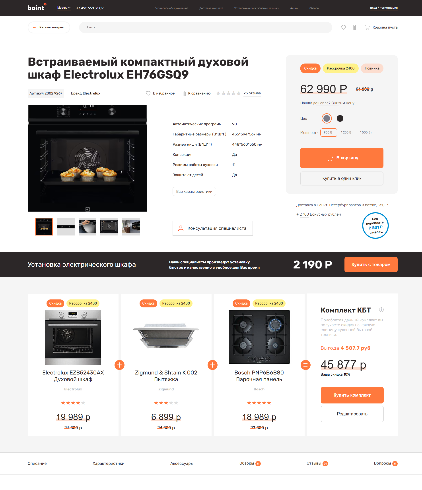

# Boint – Product Page




---

## 🔗 Live Demo
[https://boint-eight.vercel.app](https://boint-eight.vercel.app)

---

## 📌 Описание проекта

Адаптивная страница товара интернет-магазина с современным дизайном и чистой версткой.  
Проект создан для практики frontend навыков: адаптивность, UI, структура и базовый JS функционал.

---

## 🚀 Функциональность

- Адаптивная верстка под все устройства  
- Карточка товара с изображениями  
- Галерея изображений с переключением  
- Чистая и семантическая структура HTML  
- Оптимизированные CSS стили для скорости загрузки  
- Hover и простые анимации элементов  

---

## 🛠 Стек технологий

- HTML5  
- CSS3 / SCSS  
- JavaScript  
- Деплой на Vercel 

---

## 💻 Запуск проекта локально

1. Клонировать репозиторий:  
```bash
git clone https://github.com/prepelicaoleksandr-dot/boint.git

Перейти в папку проекта:

cd boint

Открыть файл index.html в браузере

👨‍💻 Автор

Александр Препелица – Frontend Developer
